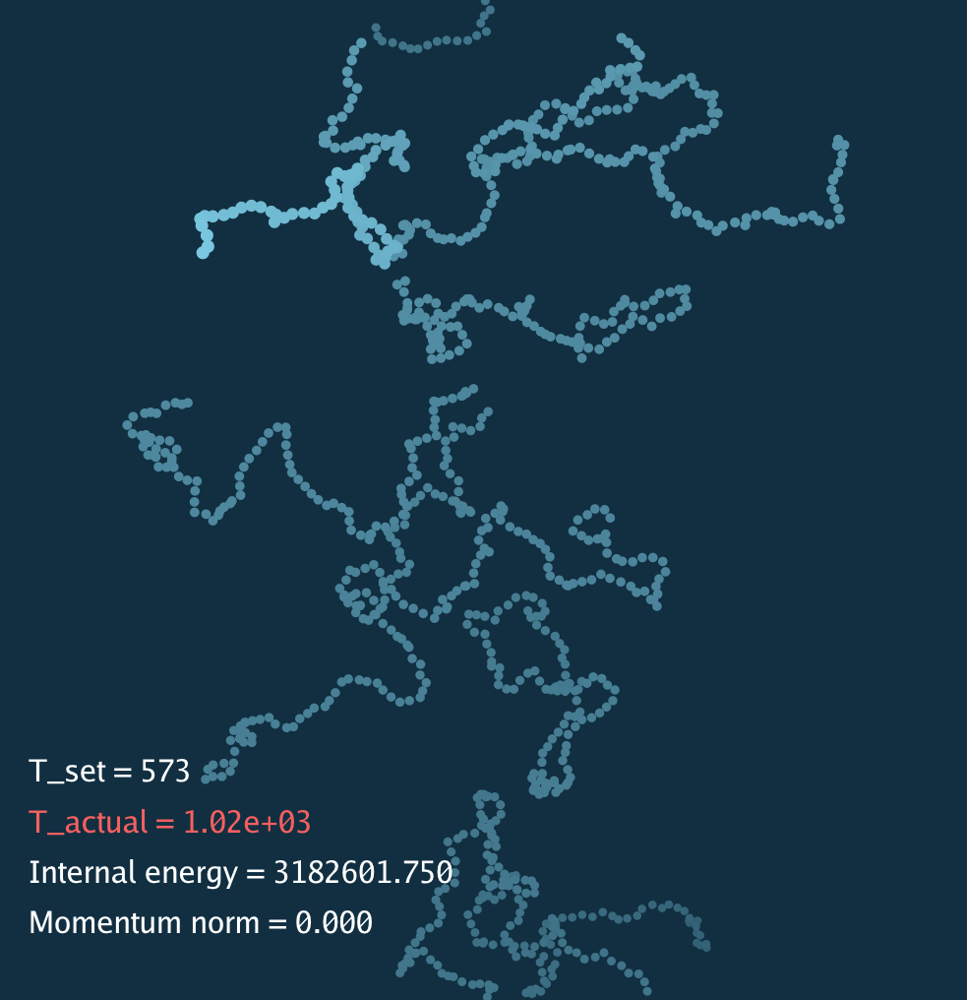
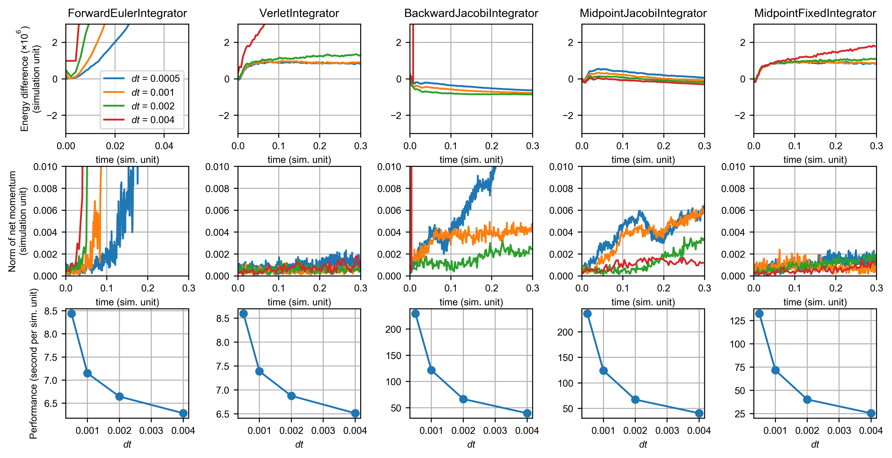

A variety of time integrators was implemented and benchmard for molecular dynamics simulations.

* Forward Euler integrator
* Verlet integrator (symplectic)
* Backward Euler integrator
* Implicit midpoint integrator (symplectic)

For implicit integrators, the equation of motion is solved by two methods: (1) Using a first-order approximation for the force to construct a linear system (as in GAMES201 lectures), and solving the linear system using the Jacobi method, and (2) directly solving the non-linear system using fixed point iteractions. Linearizing the implicit solver requires computing the Hessian for the potential energy of the system. The equations to calculate the Hessian for pairwise potentials are derived [here](calculate_hessian.pdf).

As a molecular simulation methods, **conservation of energy** is the most important factor for evaluating the quality of time integrators. Correct thermodynamic properties for the system can be obtained only when the energy of the system is conserved (for the *NVE* ensemble).

Two simulation systems were investigated:

1. Lennard-Jones fluid system with 4096 particles (LJ) with reduced density of 0.1.
)

2. System of 10 polymer chains with 100 beads in each chain with a harmonic bond stretching potential, the equilibrium bond length between two beads is 1.54 Å and the simulation box length is 160 Å.

This figure shows the performance of integrators for the Lennard-Jones system:
 

It can be readily observed that the Forward Euler method and the Backward Euler method doe not conserve energy. Forward Euler gives a smooth increase in the total energy of the system and backward Euler gives a smooth decrease (numerical damping), after the simulation has been running for a while. However, both methods conserve momentum better than energy. Note that with the smallest time step, the energy of forward Euler exploded at t < 0.5 while the momentum didn't explode.

The Verlet integrator is the most commonly used method for molecular dynamics, and it gave very good performance in both energy and momentum. Comparing the Jacobi method and the fixed point method in solving the implicit midpoint integrator, the Jacobi method was not able to conserve energy and momentum at larger time steps. This is likely due to the numerical errors in calculating the Hessian and omitting second or higher-order terms in constructing the linear system. With the fixed point method, the implicit midpoint integrator even conserves energy better than the Verlet integrator, albeit being much slower.

This figure shows the performance of integrators for the polymer chain system:
 

The polymer system is essentially a mass-spring system with Lennard-Jones intermolecular interactions. It has a very stiff bond stretching potential, therefore the forward Euler integrator exploded rapidly. Compared with explicit methods, implicit integrator is much more stable for this system. The backward integrator still resulted in numerical damping, but there is also a drift in the net momentum. The midpoint fixed integrator still gave a good result as indicated by the conservation laws. Note that there was a initial increase in the total energy for both symplectic integrators. This is because the system was initialized at a very pathological configuration that all chains are perfectly straight and horizontally aligned. 

Below is a simulation movie for the polymer system. The total energy increases because of the choice of initialization.
 

